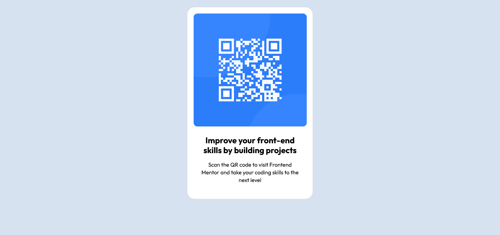

# Frontend Mentor - QR code component solution

This is a solution to the [QR code component challenge on Frontend Mentor](https://www.frontendmentor.io/challenges/qr-code-component-iux_sIO_H). Frontend Mentor challenges help you improve your coding skills by building realistic projects.

## Table of contents

- [Overview](#overview)
  - [Screenshot](#screenshot)
  - [Links](#links)
  - [Built with](#built-with)
  - [What I learned](#what-i-learned)
  - [Continued development](#continued-development)
  - [Useful resources](#useful-resources)
- [Author](#author)

## Overview

### Screenshot

### Links

- Solution URL: [Code](https://github.com/osman-beni/qr-code-component)
- Live Site URL: [Demo](https://osman-beni.github.io/qr-code-component/)

### Built with

- Semantic HTML5 markup
- CSS custom properties
- Flexbox
- Mobile-first workflow

### What I learned

Re-enforced the basics i have learnt

### Continued development

I still don't feel comfortable with everything i'm doing. So will be focusing more on everything i have learnt so far.

### Useful resources

- [Duck Ai](https://duck.ai) - I had some misunderstanding with how the layers feature in css worked. It helped understand a little better.
- [CSS in Depth](https://www.manning.com/books/css-in-depth-second-edition) - This is an amazing book which helped me understand a lot about CSS. I'd recommend it to anyone still learning CSS.

## Author

- Frontend Mentor - [@osman-beni](https://www.frontendmentor.io/profile/@osman-beni)
